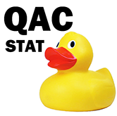

# qacStats

qacStats is an R package of statistical functions that can be used for data exploration and teaching. They have been created by students in *QAC 356: Advanced R* at Wesleyan University.
